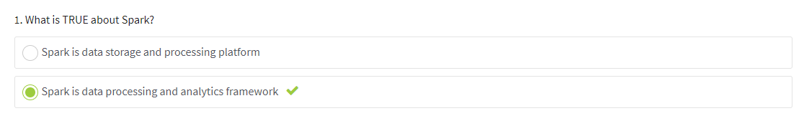
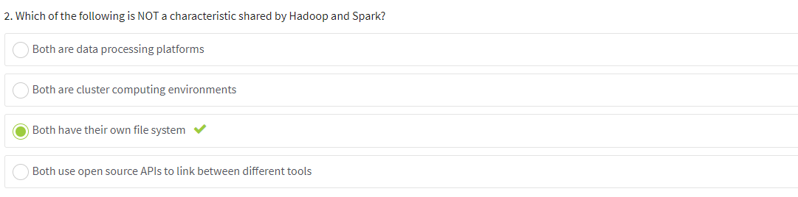
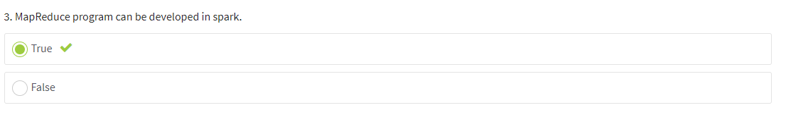
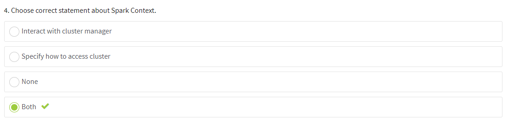
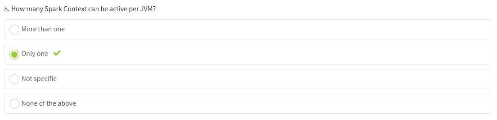

# Spark basics
- bdcc-data-etl - module with source code to implement etl logic
- terraform - infrastructure as code to deploy all resources in cloud

## CHOOSE THE CORRECT ANSWER.

1. What is TRUE about Spark?

2. Which of the following is NOT a characteristic shared by Hadoop and Spark?

3. MapReduce program can be developed in spark.

4. Choose correct statement about Spark Context.

5. How many Spark Context can be active per JVM?

