# Spark basics
- bdcc-data-etl - module with source code to implement etl logic
- terraform - infrastructure as code to deploy all resources in cloud

## That is spark?
1. What is TRUE about Spark? 
2. Which of the following is NOT a characteristic shared by Hadoop and Spark? 
3. MapReduce program can be developed in spark. 
4. Choose correct statement about Spark Context. 
5. How many Spark Context can be active per JVM? 

## Spark Installation and Deployment
1. Which Cluster Manager does Spark support? 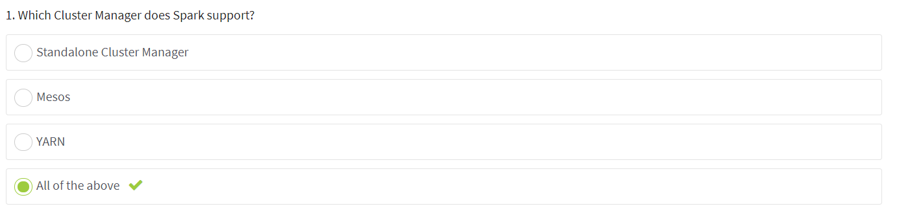
2. Deployment modes are supported by Spark for YARN cluster: 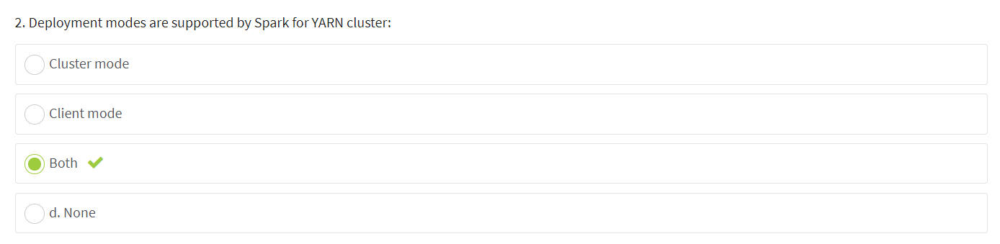
3. What cluster scheduler(s) is/are supported by Spark? 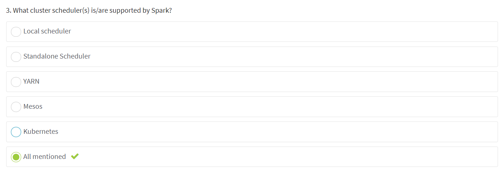
4. Spark UI is unavailable while Driver is running. 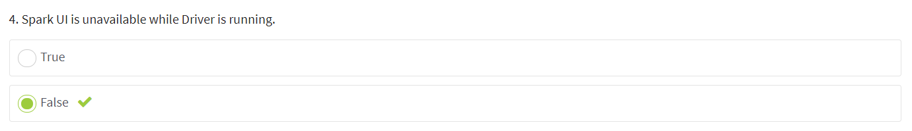
5. The second stage of word counting application from the example in the video includes the following operations: 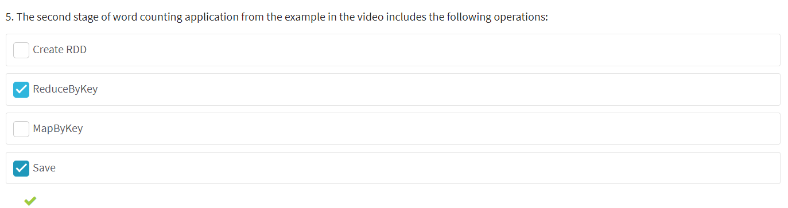

## Spark RDD. Transformations and Actions
1. What is Spark Core Abstraction? 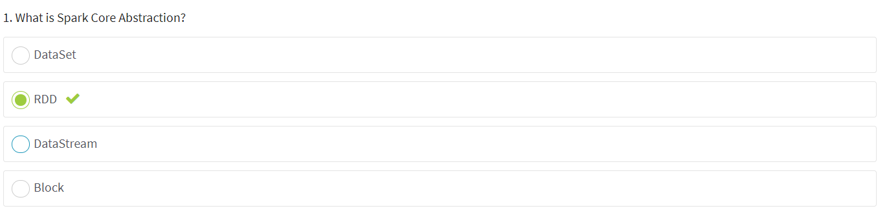
2. Fault Tolerance in RDD is achieved using: 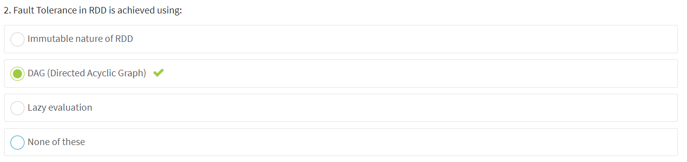

## Pair RDD. Shared Variables. Shared Variables Caching. Smart Sources:
1. RDD operations: 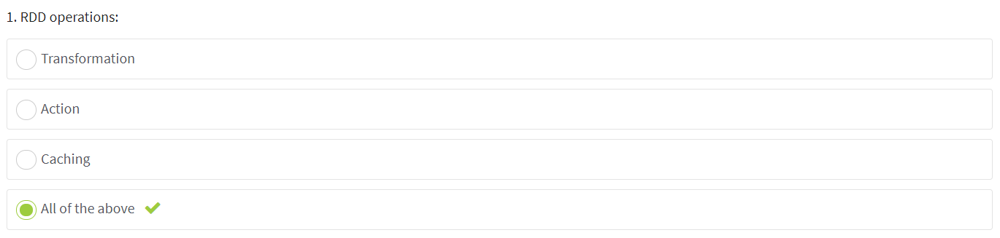
2. Identify correct transformation. 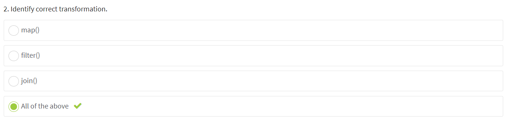
3. What types of shared variables does spark provide? 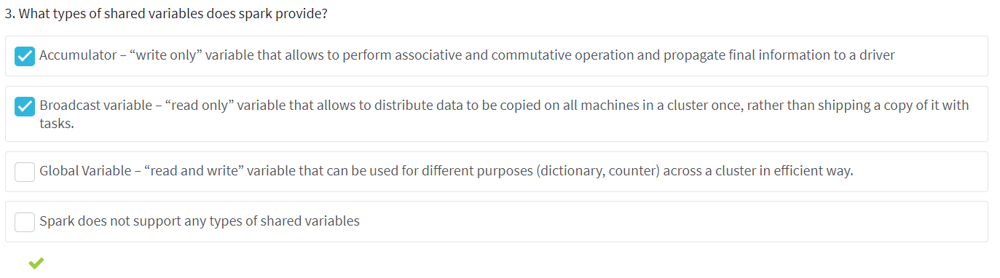
4. What is true regarding shared variables? 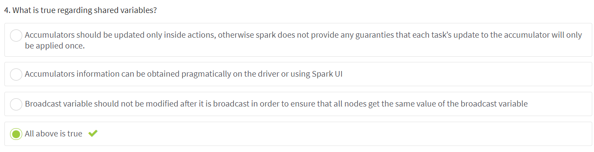
5. Identify correct ways to cache rdd. 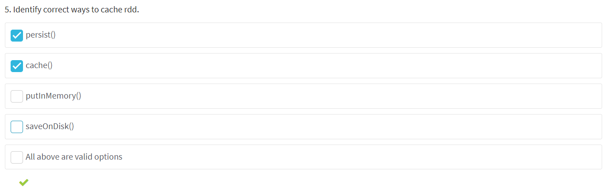
6. Sparks provides different storage levels for performing caching data across partitions. 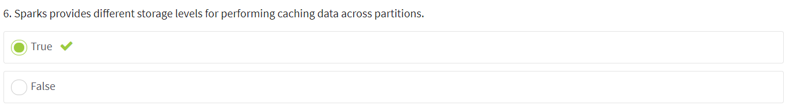
7. What advantages in terms of “Smart” are correct? 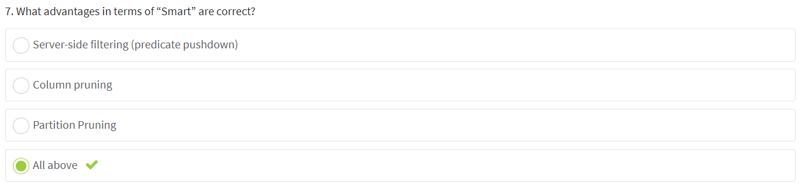
