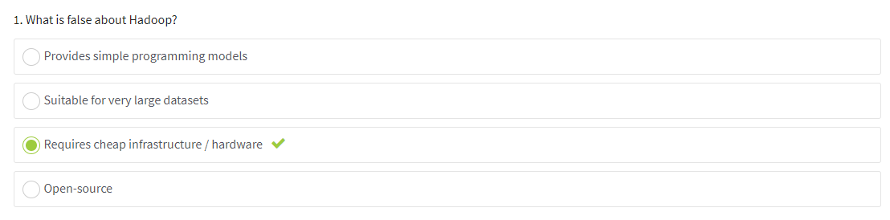
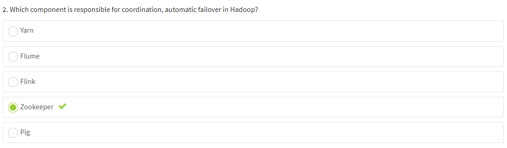
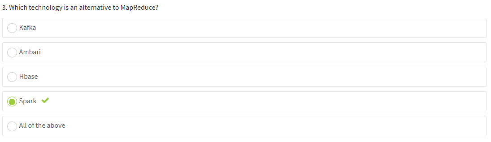
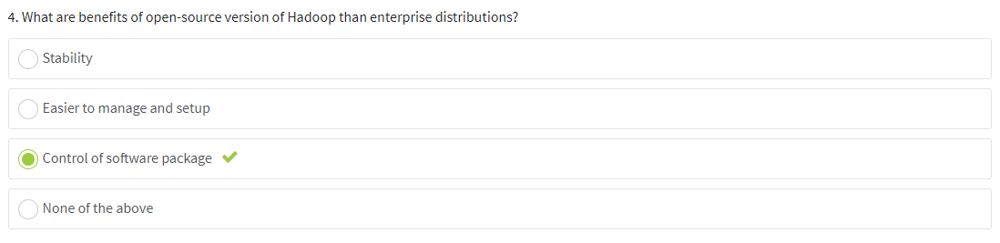
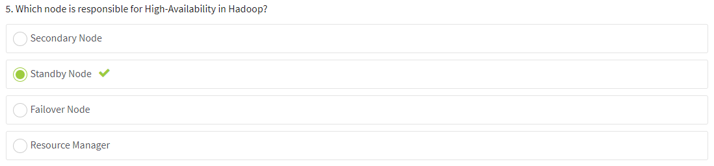
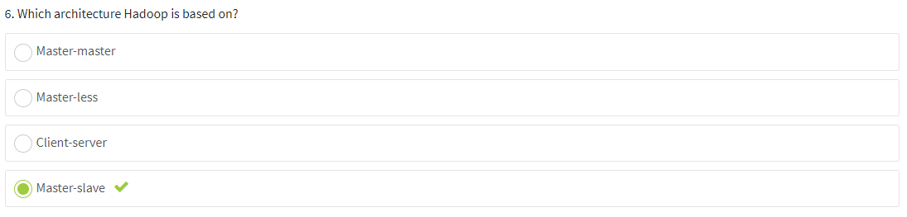
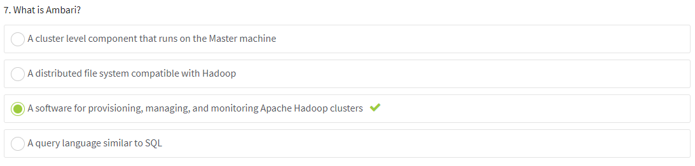

# Introduction to Hadoop

## [Task 1](./task-1)
- Install latest Docker Desktop with Kubernetes capabilities or VirtualBox with [minikube](https://kubernetes.io/docs/tasks/tools/install-minikube/).
- Download latest [HDP Sandbox 3.x](https://www.cloudera.com/downloads/hortonworks-sandbox.html) to your computer (Docker/VirtualBox).
- Install and run HDP Sandbox.
- Describe basic components of Ambari UI. Make screenshots.

### [Task 2](./task-2)
- Install Kafka service if not installed by default. Run and make screenshots of running service.
- Create a new topic via CLI, write a message in a console producer and read it in console consumer. Make screenshots.

### Expected Outputs
- ZIP-ed folder with your screenshots

### Acceptance Criteria
- A service is installed and working.
- Kafka messages are printed.

# Both tasks are done!

# Quiz:

