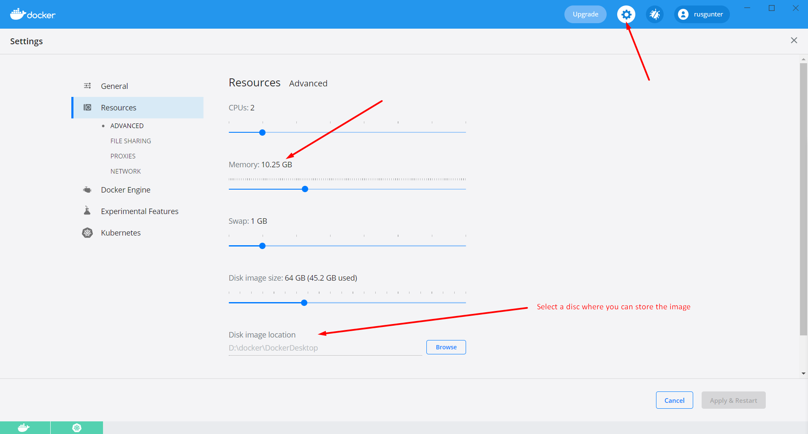
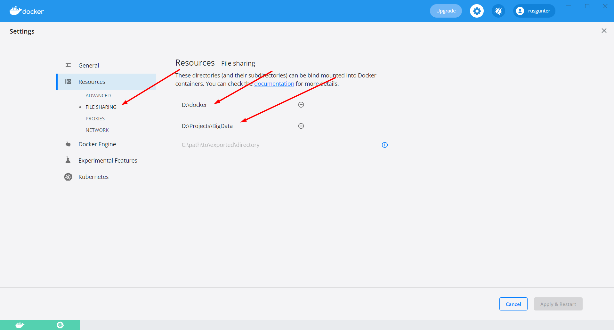
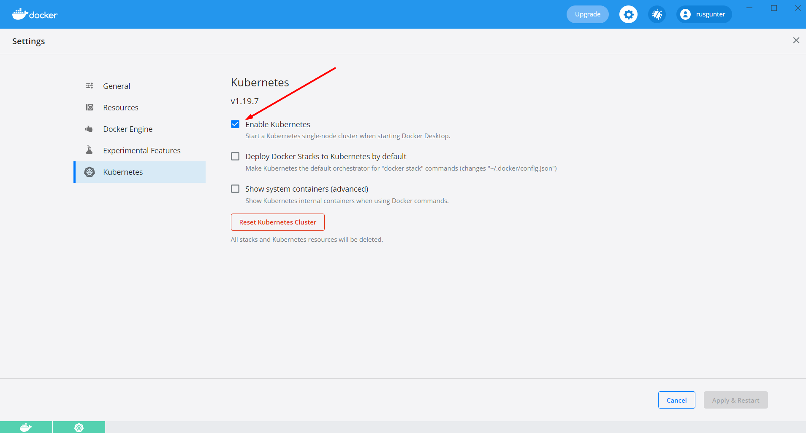
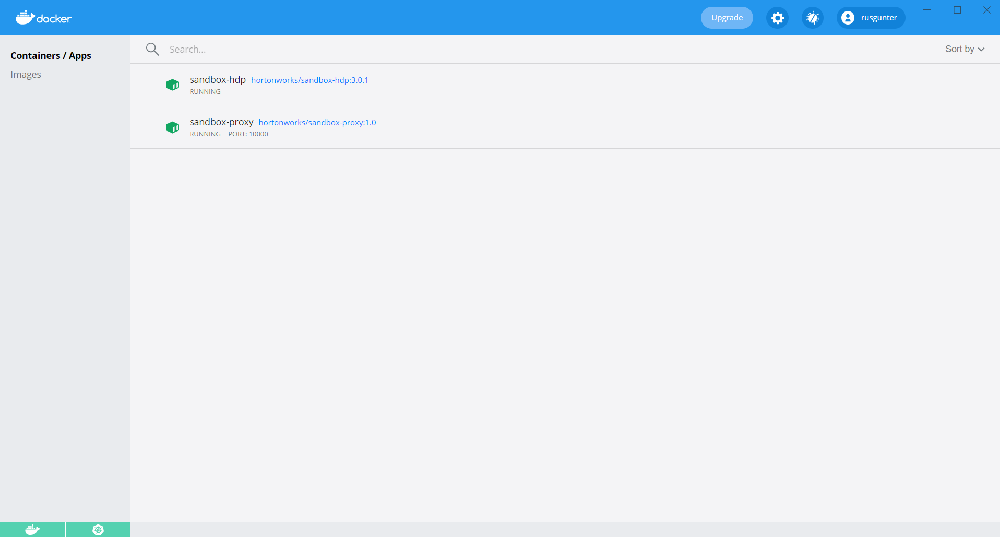
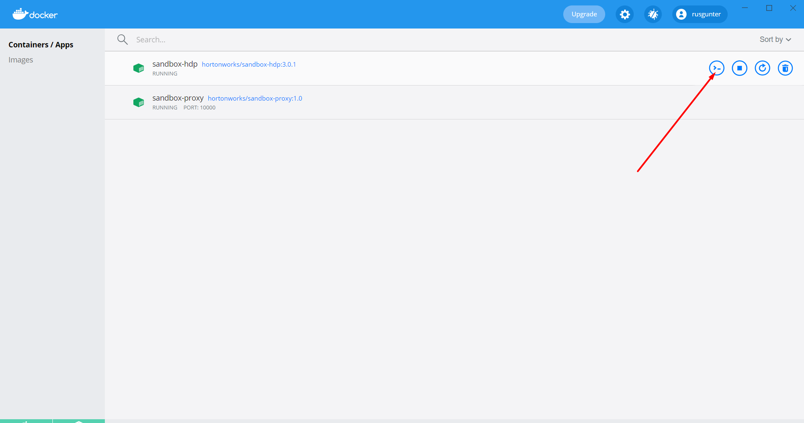
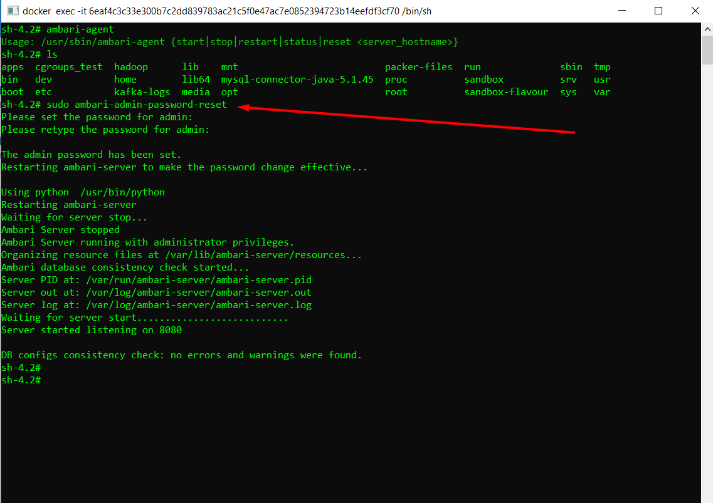
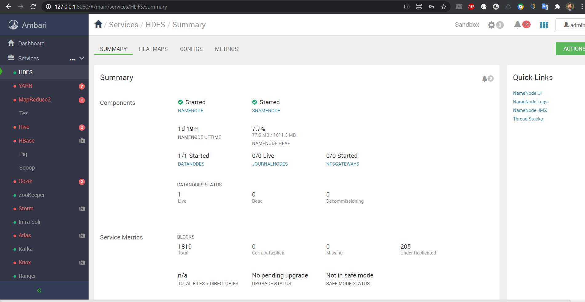

# Task 1

## Fallow the [instructions](https://www.cloudera.com/tutorials/sandbox-deployment-and-install-guide/3.html)
- Install ans setup **docker** and **kubernetes** and install resources:

- Run installation script:
  - HDP_3.0.1_docker-deploy-scripts/docker-deploy-hdp30.sh
  - You can have some issues with ports. Try this:
      - net stop winnat
      - run the installation script
      - net start winnat

- Check the link: http://127.0.0.1:8080/
- Reset admin password:

## Result:

