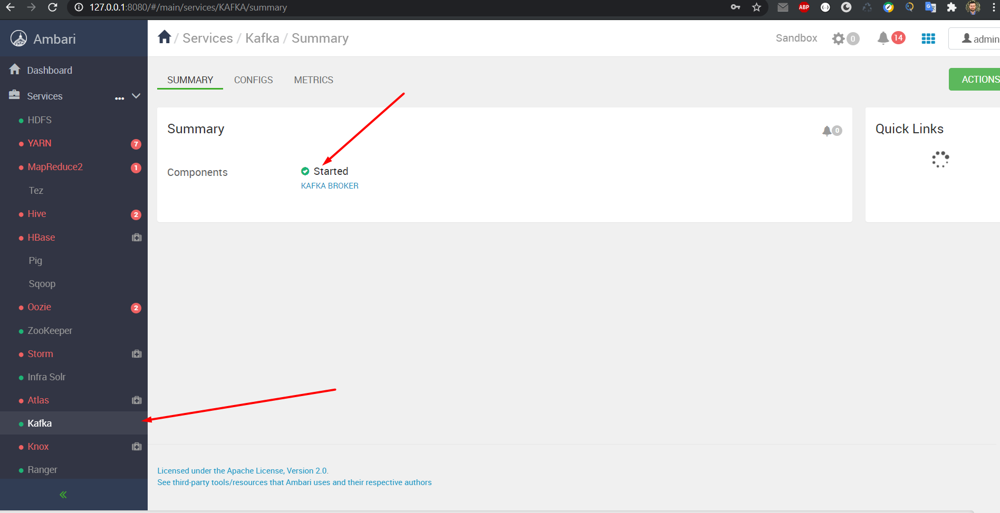
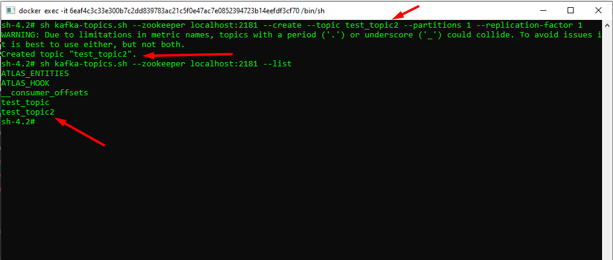
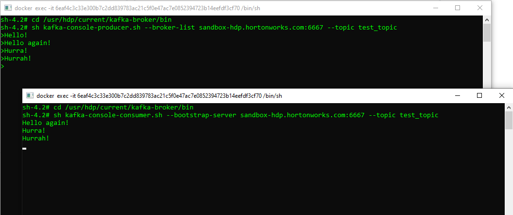

# Task 2

## Install Kafka service if not installed by default. Run and make screenshots of running service.

## Create a new Topic via CLI
- Head to: /usr/hdp/current/kafka-broker/bin
- Create topic: sh kafka-topics.sh --create --zookeeper sandbox-hdp.hortonworks.com:2181 --replication-factor 1 --partitions 1 --topic <topic_name>
- Check list: sh kafka-topics.sh --list --zookeeper sandbox-hdp.hortonworks.com:2181
- 

## Create the Producer via CLI
- Head to: /usr/hdp/current/kafka-broker/bin
- Run: sh kafka-console-producer.sh --broker-list sandbox-hdp.hortonworks.com:6667 --topic <topic_name>
- Start writing your message

## Create the Consumer via CLI
- Head to: /usr/hdp/current/kafka-broker/bin
- Run: sh kafka-console-consumer.sh --bootstrap-server sandbox-hdp.hortonworks.com:6667 --topic <topic_name>
- Go back to the other console, and write something else

## Result:

