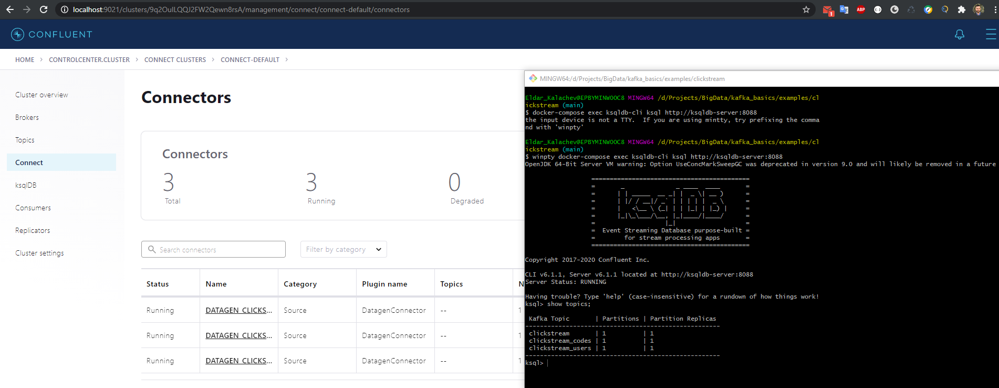

# Kafka Basics Homework

To complete [Clickstream Data Analysis Pipeline Using KSQL (Docker)](https://docs.confluent.io/current/ksql/docs/tutorials/clickstream-docker.html#ksql-clickstream-docker) tutorial. Tutorial focuses on building real-time analytics of users to determine:

- General website analytics, such as hit count and visitors
- Bandwidth use
- Mapping user-IP addresses to actual users and their location
- Detection of high-bandwidth user sessions
- Error-code occurrence and enrichment
- Sessionization to track user-sessions and understand behavior (such as per-user-session-bandwidth, per-user-session-hits etc)

The tutorial uses standard streaming functions (i.e., min, max, etc) and enrichment using child tables, stream-table join, and different types of windowing functionality.

## Create the Clickstream Data (on Windows)

1. Clone the repository
2. Open git bush
3. Navigate [click stream example](./examples/clickstream)
4. Run commands:
    > docker run -v $PWD/confluent-hub-components:/share/confluent-hub-components confluentinc/ksqldb-server:0.8.0 confluent-hub install --no-prompt confluentinc/kafka-connect-datagen:0.4.0
    > docker run -v $PWD/confluent-hub-components:/share/confluent-hub-components confluentinc/ksqldb-server:0.8.0 confluent-hub install --no-prompt confluentinc/kafka-connect-elasticsearch:10.0.2
5. Launch the tutorial in Docker
    > docker-compose up -d
6. After a minute or so, run the **docker-compose ps** status command to ensure that everything has started correctly:
    > docker-compose ps
   
    
   
    
   
7. Launch the ksqlDB CLI:
    > docker-compose exec ksqldb-cli ksql http://ksqldb-server:8088

   
   
8. Run the script create-connectors.sql that executes the ksqlDB statements to create three source connectors for generating mock data.
    > RUN SCRIPT '/scripts/create-connectors.sql';
9. Go to Confluent Control Center UI at [http://localhost:9021](http://localhost:9021) and view the three kafka-connect-datagen source connectors created with the ksqlDB CLI.

   

## Load the Streaming Data to ksqlDB

1. Load the statements.sql file that runs the tutorial app
    > RUN SCRIPT '/scripts/statements.sql';
2. Go to Confluent Control Center UI at [http://localhost:9021](http://localhost:9021), and verify that data is being streamed through various tables and streams. Query one of the streams CLICKSTREAM:
    

## Load the Clickstream Data in Grafana

1. Set up the required Elasticsearch document mapping template:
    > winpty docker-compose exec elasticsearch bash -c '//scripts/elastic-dynamic-template.sh'
   
   
   
2. Run this command to send the ksqlDB tables to Elasticsearch and Grafana:
    > winpty docker-compose exec ksqldb-server bash -c '//scripts/ksql-tables-to-grafana.sh'
   
   
   
3. Load the dashboard into Grafana.
    > winpty docker-compose exec grafana bash -c '//scripts/clickstream-analysis-dashboard.sh'
4. Navigate to the Grafana dashboard at [http://localhost:3000](http://localhost:3000). Enter the username and password as **user** and **user**. Then navigate to the **Clickstream Analysis Dashboard**.
   
   
5. In the Confluent Control Center UI at [http://localhost:9021](http://localhost:9021), again view the running connectors. The three kafka-connect-datagen source connectors were created with the ksqlDB CLI, and the seven Elasticsearch sink connectors were created with the ksqlDB REST API.
   

## Sessionize the data

One of the tables created by the demo, CLICK_USER_SESSIONS, shows a count of user activity for a given user session. All clicks from the user count towards the total user activity for the current session. If a user is inactive for 30 seconds, then any subsequent click activity is counted towards a new session.

The clickstream demo simulates user sessions with a script. The script pauses the DATAGEN_CLICKSTREAM connector every 90 seconds for a 35 second period of inactivity. By stopping the DATAGEN_CLICKSTREAM connector for some time greater than 30 seconds, you will see distinct user sessions.

You’ll probably use a longer inactivity gap for session windows in practice. But the demo uses 30 seconds so you can see the sessions in action in a reasonable amount of time.

Session windows are different because they monitor user behavior and other window implementations consider only time.

To generate the session data execute the following statement from the examples/clickstream directory:

> ./sessionize-data.sh

The script will issue some statements to the console about where it is in the process.

## View solution:

- General website analytics, such as hit count and visitors
- Bandwidth use
- Mapping user-IP addresses to actual users and their location
- Detection of high-bandwidth user sessions
- Error-code occurrence and enrichment
- Sessionization to track user-sessions and understand behavior (such as per-user-session-bandwidth, per-user-session-hits etc)

