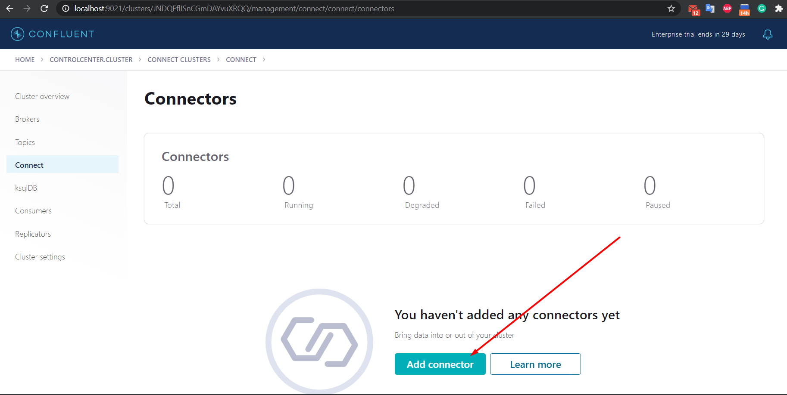

# Kafka connect in Kubernetes

## Install Confluent Hub Client

You can find the installation manual [here](https://docs.confluent.io/home/connect/confluent-hub/client.html)

For local Kubernetes was used WSL2. I installed the **confluent client** there.

## Create a custom docker image

For running the azure connector, you can create your own docker image. Create a docker file:

```cmd
FROM confluentinc/cp-server-connect-operator:6.1.0.0 AS base

USER root

RUN confluent-hub install --no-prompt confluentinc/kafka-connect-azure-blob-storage:1.6.2 \
    && confluent-hub install --no-prompt confluentinc/kafka-connect-azure-blob-storage-source:1.4.5

USER user
```

Then run the command:

```cmd
docker build -t "my-azure-connector:1.0.0" .
```

## Launch Confluent for Kubernetes

### Create a namespace

- Create the namespace to use:

  ```cmd
  kubectl create namespace confluent
  ```

- Set this namespace to default for your Kubernetes context:

  ```cmd
  kubectl config set-context --current --namespace confluent
  ```

### Install Confluent for Kubernetes

- Add the Confluent for Kubernetes Helm repository:

  ```cmd
  helm repo add confluentinc https://packages.confluent.io/helm
  helm repo update
  ```

- Install Confluent for Kubernetes:

  ```cmd
  helm upgrade --install confluent-operator confluentinc/confluent-for-kubernetes
  ```

### Install Confluent Platform

- Install all Confluent Platform components:

  ```cmd
  kubectl apply -f ./confluent-platform.yaml
  ```

- Install a sample producer app and topic:

  ```cmd
  kubectl apply -f ./producer-app-data.yaml
  ```

- Check that everything is deployed (watch command is only for linux):

  ```cmd
  watch kubectl get pods
  ```

  

### View Control Center

- Set up port forwarding to Control Center web UI from local machine:

  ```cmd
  kubectl port-forward controlcenter-0 9021:9021
  ```

- Browse to Control Center: [http://localhost:9021](http://localhost:9021)

## Create a kafka topic

- The topic should have at least 3 partitions because the azure blob storage has 3 partitions. Name the new topic: "expedia".

## Prepare the azure connector configuration

```cmd
{
  "name": "expedia",
  "config": {
      "azblob.account.name": "<account name>",
      "azblob.container.name": "<container name>",
      "azblob.account.key": "<account key>",

      "connector.class": "io.confluent.connect.azure.blob.storage.AzureBlobStorageSourceConnector",
      "tasks.max": "1",
      "format.class": "io.confluent.connect.azure.blob.storage.format.avro.AvroFormat",
      "confluent.topic.bootstrap.servers": "PLAINTEXT://kafka:9092",
      "confluent.topic.replication.factor": "3",

      "transforms": "mask-timestamp",
      "transforms.mask-timestamp.type": "org.apache.kafka.connect.transforms.MaskField$Value",
      "transforms.mask-timestamp.fields": "date_time,srch_ci,srch_co",
      "transforms.mask-timestamp.replacement": "0000-00-00 00:00:00"
  }
}
```

## Upload the connector file through the API





## The result


