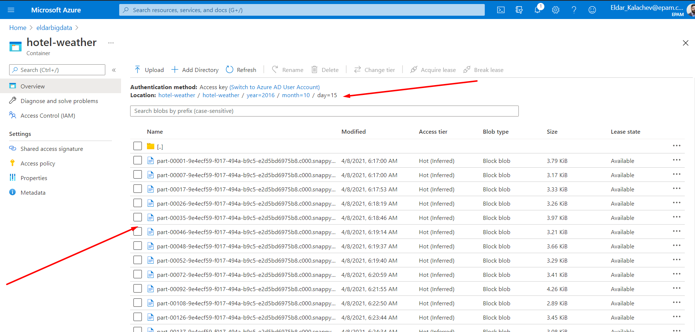

# Spark basics homework
- Create Spark etl job to read data from Azure ADLS gen2 storage.
- Check hotels data on incorrect (null) values (Latitude & Longitude). For incorrect values map (Latitude & Longitude) from [OpenCage Geocoding API](https://opencagedata.com/api) in job on fly (Via REST API).
- Generate geohash by Latitude & Longitude using one of geohash libraries (like geohash-java) with 4-characters length in extra column.
- Join weather and hotels data by generated 4-characters geohash (avoid data multiplication and make you job idempotent)

## Expected tables for reading
### Hotel:
| address | city | country | id | latitude | longitude | name |
| --- | --- | --- | --- | --- | --- | --- |
| Towneplace Suites | Bowie | US | 1099511627779 | 38.94262 | -76.73404 | 23500 Welcome Way Dr |
| Americas Best Val... | Chico | US | 1245540515840 | null | null | 740 Broadway St |

### Weather
| avg_tmpr_c | avg_tmpr_f | day | lat | lng | month | wthr_date | year |
| --- | --- | --- | --- | --- | --- | --- | --- |
| 18.5 | 65.3 | 29 | 20.5816 | -98.4092 | 8 | 2017-08-29 | 2017 |
| 29.1 | 84.4 | 29 | 19.721 | -75.5616 | 8 | 2017-08-29 | 2017 |

### Expected result
Stored enriched data (joined data with all the fields from both datasets) is provisioned with terraform Azure ADLS gen2 storage preserving data partitioning in parquet format in “data” container (it marked with prevent_destroy=true and will survive to terraform destroy).

| address | avg_tmpr_c | avg_tmpr_f | city | country | day | geoHash | id | latitude | longitude | month | name | wthr_date | year |
| --- | --- | --- | --- | --- | --- | --- | --- | --- | --- | --- | --- | --- | --- |
| Watermark Bed Bre... | 18.5 | 65.3 | Wittman | US| 29 | dqcs | 867583393793 | 38.796997 |  -76.30522 | 8 | 8956 Tilghman Isl... | 2017-08-29 | 2017 |
| Melody Lodge Cabins | 16.7 | 62.1 | Silverthorne | US | 29 | 9xh6 | 1443109011461 | 39.840855 | -106.23464 | 8| 1534 County Road 30 | 2017-08-29 | 2017 |
| Comfort Suites | 24.4 | 75.9 | Houston | US | 27 | 9vk0 | 111669149696 | 29.681085 | -95.402996 | 8 | 1055 E Mcnee Road... | 2017-08-27 | 2017 |

## Setup variables:
- Use *[docker-compose.yml](./hotel-weather-job/docker-compose.yml)* to setup and run application.
  - spark_master: "k8s://https://<domain>:<port>"
  - blob_read_account_name: "<blob account name wherefrom data will be read>"
  - blob_read_container_name: "<blob container name wherefrom data will be read>"
  - blob_read_container_key: "<blob container key name wherefrom data will be read>"
  - blob_write_account_name: "<blob account name where data will be written>"
  - blob_write_container_name: "<blob container name where data will be written>"
  - blob_write_container_key: "<blob container key where data will be written>"
  - opencage_api_key: "<[opencage api key](https://opencagedata.com/api) for getting geo locations for rows with NULL values>"

