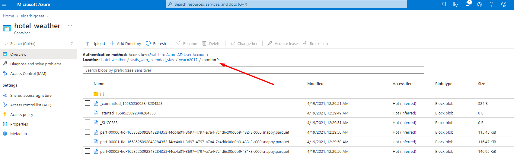

# Spark SQL Homework

- Create Databricks Notebooks. Azure libraries like hadoop-azure and azure-storage are already part of Databricks environment. Details are described here. Create delta tables based on data in sorage account.
- Using Spark SQL to calculate and visualize in Databricks Notebooks, for queries use hotel_id (hotel id – join key), srch_ci (checkin), srch_co (checkout):
    - Top 10 hotels with max absolute temperature difference by month.
    - Top 10 busy (e.g. with the biggest visits count) hotels for each month. If visit dates refer to several months it should be counted for all affected months.
    - For visits with extended stay (more than 7 days) calculate weather trend (the day temperature difference between last and first day of stay) and average temperature during stay.
- For designed queries analyze execution plan. What is the bottleneck of your jobs? For each analysis you could create tables with proper structure and partitioning if necessary.
- Deploy Databricks Notebook on cluster, to setup infrastructure use terraform scripts from module. Development and testing is recommended to do locally in your IDE environment with delta delta-core library.
- Store final DataMarts and intermediate data (joined data with all the fields from both datasets) in provisioned with terraform Azure ADLS gen2 storage preserving data partitioning in parquet format in “data” container (it marked with prevent_destroy=true and will survive terraform destroy).

## Expected results
- Repository with notebook (with output results), configuration scripts, application sources, execution plan dumps, analysis and etc.
- Upload in task Readme MD file with link on repo, fully documented homework with screenshots and comments.

## Solution:
The task was done on SQL programming language for increasing the challenge. I tried to exclude python and scala as much as possible from the task.

### [Investigation of the data](./spark-sql-homework/spark-sql-hw-investigation.sql)

### [Top 10 hotels with max absolute temperature difference by month.](./spark-sql-homework/task1-top-10-hotels-max-abs-tmpr-diff.sql)

  
  
  
  
### [Top 10 busy (e.g. with the biggest visits count) hotels for each month. If visit dates refer to several months it should be counted for all affected months.](./spark-sql-homework/task2-top-10-busy-hotels.sql)

  
  
  
  
### [For visits with extended stay (more than 7 days) calculate weather trend (the day temperature difference between last and first day of stay) and average temperature during stay.](./spark-sql-homework/task3-visits-with-extended-stay.sql)

  
  
  
  
## To run the scripts you will need to setup a config file

Create a new notebook in the same dir as SQL files. Set up python programming language for the new notebook. Then copy the following code:
```python
spark.conf.set("fs.azure.account.auth.type.<reading-storage-account-name>.dfs.core.windows.net", "OAuth")
spark.conf.set("fs.azure.account.oauth.provider.type.<reading-storage-account-name>.dfs.core.windows.net", "org.apache.hadoop.fs.azurebfs.oauth2.ClientCredsTokenProvider")
spark.conf.set("fs.azure.account.oauth2.client.id.<reading-storage-account-name>.dfs.core.windows.net", "<application-id>")
spark.conf.set("fs.azure.account.oauth2.client.secret.<reading-storage-account-name>.dfs.core.windows.net", "<application-secret>")
spark.conf.set("fs.azure.account.oauth2.client.endpoint.<reading-storage-account-name>.dfs.core.windows.net", "https://login.microsoftonline.com/<directory-id>/oauth2/token")
# Storage for writing result
spark.conf.set("fs.azure.account.key.<writing-storage-account-name>.dfs.core.windows.net", "<secret-key>")
```
