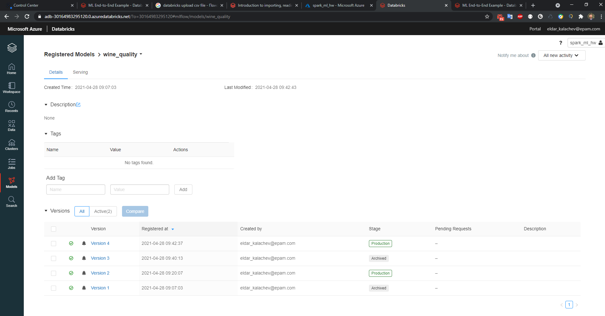
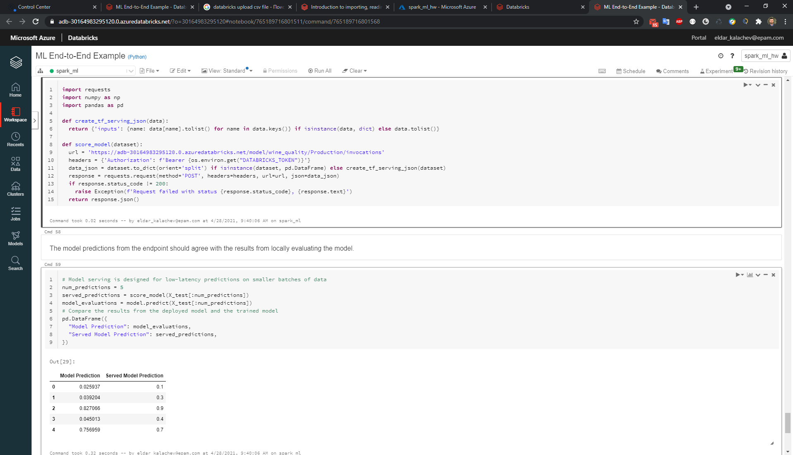

# Training Machine Learning Models on Tabular Data: An End-to-End Example

This tutorial covers the following steps:

- Import data from your local machine into the Databricks File System (DBFS)
  > Download data [here](./data)
- Visualize the data using Seaborn and matplotlib
- Run a parallel hyperparameter sweep to train machine learning models on the dataset
- Explore the results of the hyperparameter sweep with MLflow
- Register the best performing model in MLflow
- Apply the registered model to another dataset using a Spark UDF
- Set up model serving for low-latency requests

In this example, you build a model to predict the quality of Portugese "Vinho Verde" wine based on the wine's physicochemical properties.

The example uses a dataset from the UCI Machine Learning Repository, presented in [Modeling wine preferences by data mining from physicochemical properties](https://www.sciencedirect.com/science/article/pii/S0167923609001377?via%3Dihub) [Cortez et al., 2009].

## Requirements
This notebook requires Databricks Runtime for Machine Learning.
If you are using Databricks Runtime 7.3 LTS ML or below, you must update the CloudPickle library using the commands in the following cell.

## Result of the work:

- Presentation may be loaded [here](./presentation)
- The resulting model:

- Result prediction:
